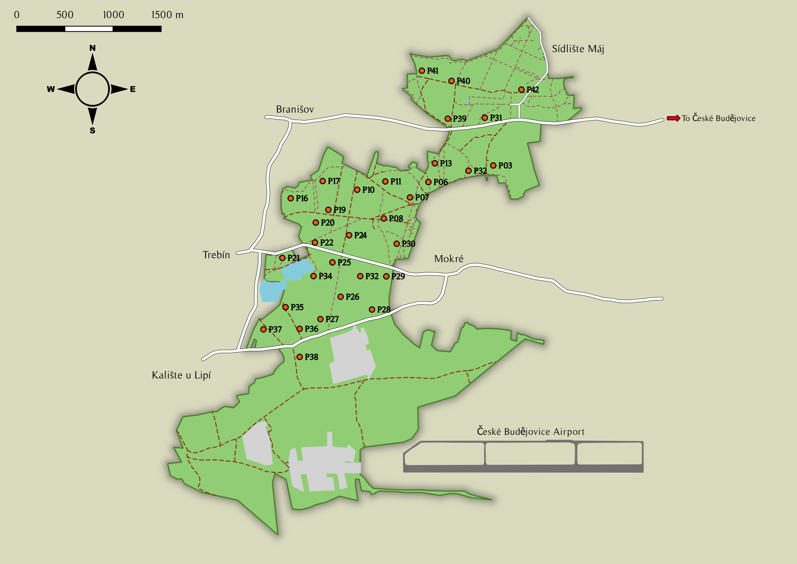

```{r setup, include=FALSE}
knitr::opts_chunk$set(echo = TRUE)
```

# Introduction

Much of our knowledge on habitat selection in free-ranging animals is restricted to the breeding season. At different scales, animals assess a wide variety of aspects and features of the environment and make a series of hierarchical choices, culminating in an affinity and preference for certain habitats over others, which is termed habitat selection *(Johnson, 1980; Cody, 1985)*. Studies on habitat selection are interested in the ways in which these preferences vary across species, space, time, etc. Broad-scale selection is reflected in species’ geographic ranges and in the landscape features surrounding home ranges, while fine-scale selection is reflected in microhabitats used for foraging, reproduction, and shelter (Fretwell & Lucas, 1969; Johnson, 1980; Saab, 1999). However, the breeding season---encompassing both the actual reproductive period, as well as the period leading up to mating---dominates a large majority of these questions (e.g., Danchin et al., 1998; Kleist et al., 2017; Bosco et al., 2021). Moreover, most such studies target migratory species, whether it be in their breeding grounds (e.g., Danchin et al., 1998; Kleist et al., 2017; Bosco et al., 2021), wintering grounds (usually in the tropics; e.g., Strasser et al., 2019; Ruiz-Sanchez et al., 2017; Albert et al., 2020) or stopover sites (e.g., Papageorgiou et al., 2017; Wolfe et al., 2014; Alonso et al., 2020; Cohen et al., 2021). 

This disproportionate attention is not unjustified: habitats chosen by animals can influence fitness outcomes via costs (e.g., predation risk) and benefits (e.g., food availability) of habitat use, and these have traditionally been strongly linked with reproductive success and offspring survival. In migrants, habitat requirements are complex and vary through the annual cycle, across their geographic range, along migratory routes, and at multiple spatial scales. Therefore, investigating their selection patterns may reveal a lot about the links between organisms and habitat and landscape features. Nevertheless, habitat dynamics during transitional extra-breeding periods can be of great importance as well, given their associated high stress and consequence as an important link in the chain. In the context of temperate birds, questions regarding habitat selection, niche breadth and community structure take on new dimensions in these periods. For one, the birds are less territorial and more mobile, allowing greater freedom in choosing foraging areas (Uesugi and Murakami, 2007). Additionally, motivations for habitat selection are straightforward and unambiguous; the main challenges are food scarcity coupled with increased food requirements, and the consequently higher predation risk---both for migrants that need to build up enough nutritional reserves and for residents that need to prepare for the oncoming winter. Parent-dependent fledgelings also transition to independent young birds that have to overcome challenges brought by the changing season and by their lack of experience in foraging, navigating and avoiding predators (Anders et al., 1997). Especially to them but also to adults, dense vegetation may provide cover and protection from adverse weather and predators. Dispersing juveniles may even collect social information regarding future site quality during the post-breeding period (Betts et al., 2008a). Things are not made easier by the arrival of migrants from the north, resulting in a higher overall resource consumption. Despite slowly growing evidence that habitat selection in birds may differ seasonally due to the varying ecological requirements during the different seasons (Rivera et al., 1998; King et al., 2006; Akresh et al., 2009; Vitz and Rodewald, 2011; Dittmar et al., 2014), the post-breeding period remains understudied, at least in part due to the much lower vocal activity of birds in this period. 

Species vary in their degree of selectivity from generalists to specialists, with the latter being less flexible and more susceptible to change (Devictor et al., 2008; Owens and Bennett, 2000). Many migrating land birds generally considered to be insectivorous, at least during the breeding period, cope with the food pressure in the post-breeding period by exhibiting a high level of foraging and dietary flexibility (Herrera, 1978; Gauthreaux Jr, 1982; Parrish, 1997, 2000; McWilliams and Karasov, 2001; Salewski and Jones, 2006). These birds may become facultatively frugivorous in autumn, allowing them to rapidly build up the fat reserves vital for migration, as well as making them less reliant on the declining arthropods (Bairlein and Simons, 1995; Faaborg, 2002; Bairlein, 2003; Ottich and Dierschke, 2003; Newton, 2010; Hernández, 2009). However, an important distinction between temperate forests of the Old and New Worlds is that there are no specialised obligate frugivorous species in the Old World temperate avifauna, and more importantly, European temperate forests have a much lower diversity of fruiting plants than American ones. Among the most widespread fruiting species are bramble *Rubus* spp., bilberry and blueberry *Vaccinium* spp., elderberry *Sambucus nigra*, rowan *Sorbus aucuparia* and alder buckthorn *Frangula alnus*. These species are typical of hedgerows, wood edges and disturbed patches, and old growth mixed forests, but are scarcely found in the large, compact and structurally poor stands of present-day Central European forests. Therefore, the dietary options for Central European forest birds, particularly residents, are rather limited. Selection patterns are likely to be more dependent on structural characteristics of the habitat, such as heterogeneity and diversity, and whether the species chooses to adapt to varying features or to master one. 

Oak forests are widely believed to be the most biodiversity-rich, supporting a highly diverse arthropod community which in turn supports a larger vertebrate community. These forests also have more heterogeneous canopies and understoreys than the structurally uniform coniferous forests. As a result, birds during the post-breeding period could show a strong foraging preference for oak forest patches. Terrestrial arthropods have been found to comprise a surprisingly large proportion of the diet of some wintering birds even in winter. For instance, Gibb (1960) found that birds in winter consumed around 50% of the stock of the eucosmid *Ernarmonia conicolana* which is known to be an important food source of blue tits. In spruce forests, tits (Paridae) commonly consume Lepidoptera, Hemiptera, Coleoptera and spiders (Betts, 1955). Other observations from forests suggest that spiders and insects including eggs, larvae, pupae and adults in diapause are also important winter food sources (Williams and Batzli, 1979; Jansson and Brömssen, 1981; Laurent, 1986). There is strong evidence that birds can indirectly impact terrestrial plant communities through arthropod predation (Van Bael et al., 2008; Mooney et al., 2010; Mäntylä et al., 2011), although few such studies in temperate regions have explored these effects in winter. Strictly insectivorous birds may be able to monopolise the arthropod food sources, while omnivores might enjoy the advantages that come with being generalists. 

Further, under these various ecological pressures, competitive interactions may  arise. Intraspecific competition forces some individuals to occupy less suitable habitats, widening the habitat breadth of that species, while interspecific competition has the opposite effect (Svärdson, 1949). In the presence of interspecific competition, species with similar resource use patterns (such as those within the same guild) would have smaller overall habitat breadths and overlaps. On the other hand, the absence of competition would allow them to overlap more and take advantage of their shared feeding strategy. The competitive release hypothesis (Gauthreaux Jr, 1982; sensu Chapman et al., 2011) states that intraspecific competition over limited resources in the breeding grounds during winter can predict patterns of partial migration; the decrease in overall resource availability is balanced by a reduction in the number of individuals that need resources. When applied to interspecific competition, it suggests that species that are highly territorial and competitive in the breeding season might switch to cooperation due to competitive release, as evidenced by the widespread occurrence of mixed-species foraging flocks (Greenberg, 2001). In closed habitats such as woodlands, predators attack at a close range and feeding competition is generally lower between species than within, thus favouring mixed associations of small numbers of several to many species (Terborgh, 1990). Risk of predation is thought to be a major factor driving the formation of mixed-species flocks, and species in mixed-species flocks show higher foraging and lower vigilance rates (Sridhar et al., 2009). In the absence of strong competition, birds can be expected to select for habitats that maximise foraging efficiency and, eventually, survival. Thus, the role of competition as a driver of habitat selection can be diverse and highly variable. 

These various strategies and interactions are usually linked with habitat characteristics such as canopy cover, heterogeneity, tree density and species richness (Vitz and Rodewald, 2007). Such characteristics are commonly compared with bird abundances or densities to analyse habitat selection. Berg (1997) found that bird abundances correlated positively with the presence of deciduous trees and with tree diameter, while among conifers the Norway spruce *Picea abies* was preferred over the pine *Pinus sylvestris*. Spatial segregation of habitats at a relatively fine-grained scale is suggested to allow for the co-occurrence of more species. However, in addition to hosting a low diversity of fruiting plant species, Central European forests are also less spatially heterogenous. Most modern-day forests in Central Europe have been restructured towards commercially exploited plantations dominated by spruce that form compact growths with a closed above-tree layer at maturity (Fanta, 2007). On the other hand, intense management and disturbance regimes bring in heterogeneity, but do not facilitate biodiversity for obvious reasons. In these circumstances, studies on habitat selection can provide crucial information that can better advise conservation action in the ever-globalising world. 

In this study, we investigated patterns of habitat selection exhibited by temperate forest bird communities in the post-breeding period at a fine-grained temporal (weeks) and spatial (patches) resolution. The main objectives were to identify the habitat features that are tracked most prominently in this period of high stress (i.e., the autumn-winter transition), to assess the patterns and magnitude of habitat selection as well as their possible temporal dynamism with the seasonal transition, and to explore the possibilities of ecological interactions and strategies. 

# Methodology

## Study site

The study was conducted over the course of three months (13 weeks), from the first week of July 2020 to the first week of October 2020, in a typical structurally manipulated and commercially exploited patch of Central European temperate forest (*Branisovsky les*) in České Budějovice, Czech Republic. The forest is located on the western edge of the city (48°58'55.672"N, 14°25'22.907"E), and represents a semi-urban forest stretch of around 800 ha segregated from neighbouring forests by extensive farmland, large fishponds and settlements. Situated at an altitude of approximately 400 m asl, it is technically a mixed forest, but is very patchy owing to the long history of forestry regimes as well as its connection with rural and military Czech history. The patches range from pure spruce plantations to mixed stands dominated by oak. As such, the tree community consists mostly of conifers like Norway spruce *Picea abies*, Scots pine *Pinus sylvestris*, European larch *Larix decidua* and silver fir *Abies alba*, and broad-leaved species such as pedunculate/European oak *Quercus robur*, sessile/Cornish oak *Q. petraea*, northern red oak *Q. rubra*, silver birch *Betula pendula*, quaking/Eurasian aspen *Populus tremula*, common/European beech *Fagus sylvatica*, rowan or European mountain ash *Sorbus aucuparia*, small-leaved lime or littleleaf linden *Tilia cordata*, common/European black alder *Alnus glutinosa*, Norway maple *Acer platanoides* and sycamore maple *A. pseudoplatanus*. The commonly found shrub species are alder buckthorn *Frangula alnus*, rowan *Sorbus aucuparia* and black/European elderberry *Sambucus nigra*, while ground layer vegetation is restricted to graminoids like sedges *Carex* spp. (mostly *C. brizoides*), bramble *Rubus* sp. and European blueberry *Vaccinium myrtillus*.

The entire forest stretch---with the exception of some parts either too disturbed or having restricted access---was effectively covered by selecting 32 non-random, evenly distributed circular sampling points of 30 m radius (Figure 1). The total forest area under consideration was thus around 400 ha, while the absolute cumulative area covered by the sampling points was approximately 9 ha, as they were chosen such that each point was at least 250 m away from its neighbours (although this was lowered to 200 m in three cases). Clear cuts were avoided as much as possible. We ensured that the selected set of points represented sufficiently well the natural range and diversity of habitat characteristics in the forest.
 
## Habitat surveys

Vegetation features thought to be relevant to birds in the post-breeding period were selected and measured to initially characterise the various habitat patches. The habitat class of each sampling point was recorded as ‘Interior’, ‘Road’ or ‘Edge’ according to whether or not asphalt roads and forest-to-farmland transitions occurred within 150 m from the centre of the point. This was done using an aerial map (Mapy.cz) in which asphalt roads, farmlands and forests are all clearly visible and distinguishable. At each of the 32 points, the tree, shrub and herb species were identified, and the vertical strata to which they belonged were noted. The species information was used to calculate plant species richness and diversity (Shannon’s diversity index; Shannon, 1948). Regardless of taxonomic and functional identity, plants of height $\le$ 1 m above the ground classified into the ‘Herb’ layer (this therefore included both woody- [like *Rubus*] and non-woody stemmed [like graminoids] plants, but did not exclude graminoid leaves that extended beyond 1 m from the ground); plants 1--4 m in height belonged to the ‘Understorey’ (this included shrubs like *S. aucuparia* and *F. alnus* as well as young individuals of trees like *P. abies*); and plants $\ge$ 4 m in height belonged to the ‘Canopy’ (this occasionally included *S. aucuparia*). Counts of ‘Canopy’ and ‘Understorey’ plants were taken and used to calculate density per 100 m^2. Counts were not taken for the ‘Herb’ layer due to the difficulty in some cases in determining what constitutes a single stem and since it is unlikely that birds track ground layer vegetation at the level of individual stems. Instead, the species that covered $\gt$ 50% of the ground was considered to be the ‘Dominant Ground Vegetation’ (in some cases, this was moss) and this variable was also used in analyses. In addition, presence or absence of moss in the point was noted separately regardless of whether or not it was the dominant ground layer vegetation, as its presence usually indicates the quality of and disturbance within the forest patch (Berdugo et al., 2018; Cornelissen et al., 2007).

We also calculated the proportion of deciduous tress in the 'Canopy' as this has been shown to be a more important factor than measures of tree diversity (Berg, 1997). Canopy cover at a sampling point was measured using canopy photographs taken at three equidistant sub-points within 10--15 m of the centre, which were then analysed using ImageJ software (Rasband, 1997) by converting to binary black-and-white images and calculating the percentage of cover across the whole image (see Forester, 2011; Figure S1). The measurements from each sub-point were averaged to represent mean canopy cover of a point, while the standard deviation of the three values represented the heterogeneity in canopy cover in the point (high values signifying high heterogeneity). These measurements were taken once in each sampling week. Since most deciduous trees bore leaves even in the last week of sampling, the 13 weekly measurements of both mean canopy cover and canopy heterogeneity for each sampling point were averaged to provide more accurate measures of both. Lastly, phenological characteristics of leaves, flowers and fruits of the plants in each point were also recorded weekly on an ordinal scale in order to track fruiting, flowering and leaf senescence patterns across the study period. 

## Bird counts

We surveyed bird 'abundance' by means of fixed-radius point counts, using detections as a proxy for abundance. While detections are not an accurate measure of true abundance, with many vegetation characteristics and behavioural traits affecting detectability of birds, it was sufficient for our purposes since we were not interested in estimating true population size, and the sampling points did not vary highly in terms of vegetation characteristics hindering detectability or detectability of different bird communities (rather, most birds have similarly low levels of vocal activity in the post-breeding period). Point counts were done at each of the 32 sampling points every week for 13 weeks (8 July 2020--1 October 2020), thus covering the post-breeding period from late summer till early autumn at a fine-grained temporal resolution. Each point being located at least 250 m from its neighbours assured spatiotemporal independence of consecutive point counts. Sampling was done on 2--3 days in the middle of the calendar week while the remaining days served to delineate and separate two successive ‘temporal units’. This enabled meaningful comparisons of bird abundances across weeks, as each would be sufficiently independent of the other and would thus represent a distinct time point (Table 1). 

We conducted 12--20 bird counts per sampling day, during the first five hours after sunrise (which shifted forward by around 10 minutes every week). Overcast and rainy days were avoided. We recorded the presence and counts of all birds heard or seen during a period of 20 minutes, divided into four intervals of five minutes each. Additionally, complementary information for each detection, like type of detection (visual, auditory or both), behaviour such as flyover (over the forest, within the forest canopy or not flying) or foraging (yes or no), and distance class were noted. Distance classes referred to five radial bins from the centre of the point: 0--10 m, 10--20 m, 20--30 m, 30--50 m and $\gt$ 50 m. Additionally, birds were observed for whether or not they entered the 30 m radius (i.e., entered the sampling point) at any time during the count, signifying the bird’s ‘use’ of the habitat. All birds were identified to species level when possible, but some closely related cryptics such as *Phylloscopus* spp., *Certhia* spp., *Regulus* spp. and *Dendrocopos* spp. are easy to confuse and difficult to identify correctly with just the occasional post-breeding vocalisations, and hence were often recorded as ‘spuhs’.

Prior to analysis, bird species were classified based on feeding guild as well as migration strategy. Feeding guild was determined using data from an extensive network of European ornithologists (Gregory et al., 2007, pt. Appendix 1) complemented with species descriptions from Birds of the World (Billerman et al., 2020). Migration strategy was assigned following Czech ornithological data; species of which $\gt$ 75% of the Czech breeding population migrates either short or long distances (categories 3 and 4 in Cepák et al., 2008) were considered as complete migrants for the purposes of this study; those with ‘regular and abundant wintertime occurrence in the Czech Republic’ were considered partial migrants (category 2 in Cepák et al., 2008; see also Št’astnỳ and Hudec, 2011); and the residents of category 1 (Cepák et al., 2008) were considered true residents. 

## Data analysis

To assess patterns of habitat selection by birds, we excluded birds not identified to genus level, those detected flying over the forest and those that did not enter the 30 m radius in point counts. The measured habitat variables without the ones excluded due to correlations represented the pool of candidate predictors. This set of plausible predictors was then used to build generalised linear mixed models (GLMM) following an information-theoretic approach (Burnham and Anderson, 1998). That is, the Akaike Information Criterion (Akaike, 1973, 1974), and more specifically the corrected AIC (AIC~C~; Hurvich and Tsai, 1989), was used to judge model fit. 

Analyses were conducted at two main levels of response. At the highest level, we looked for patterns of habitat selection in the whole bird community, by summing all the individual species detections per point count to obtain one 'bird abundance' value for each count, which was then used as the response variable. GLMMs were constructed using the *lme4* package (Bates et al., 2015), starting from a null model containing observer as a fixed effect and sampling points and days as crossed random effects, then building up. Point ID was used a random effect because of repeated sampling in the same points over the 13 weeks, and sampling day in order to account for the random variability in each unique day. Residuals were modelled as coming from a Poisson distribution with a log link function. Next, the week variable which had a visible effect (abundances were higher towards the end of the study period; noticed even during the bird counts), and other non-focal variables such as weather, visibility and time of count (on an ordinal scale from 1 to 10 representing which part of the first five hours of sunrise the count was done in) were added. Following this, finally the focal variables were added. For continuous or ordinal variables, both linear and polynomial terms were tested since there was no reason to assume a linear relationship with the predictors. Stepwise selection was done by comparing AIC~C~ values of all the models using the AICctab() function from the *bbmle* package (Bolker et al., 2020), with an information threshold of 2 dAIC~C~ per df. If a variable was deemed important, its interaction with ‘Week’ was next tested (i.e., whether or not habitat selection criteria changed with the progress of the season). Model diagnostics of all models were explored using the *DHARMa* package (Hartig, 2020) for distributional assumptions, heteroscedasticity, over-/underdispersion and zero-inflation. Once the selection was complete, parsimony was further tested by dropping some complex interaction terms. Finally, the most parsimonious model was selected. 

At the next level of response, we investigated whether foraging guilds differed in their habitat selection patterns. The original bird observations were summarised by guild so as to obtain for each point abundance values of all the guilds that were observed. Only two guilds had sufficiently high number of overall detections, insectivores (rather, 'invertebrate-feeders') and omnivores. Models were built separately for these two guilds, using the *glmmTMB* package (Brooks et al., 2017)  to avoid convergence issues. The data summarised at guild level was insufficient for utilisation of two crossed random effects (as was done in the first model), so the random effect of day, which had less estimated variance than that of the point, was excluded from the models. This did not result in major differences in the fixed effects estimates and so was not considered to be an issue. Model building and checking of model diagnostics was done in the same way as in the first case. All analyses were done using R version ***4.1.2 (R Core Team, 2021)***. Individual figures with multiple graphs were composed using the *patchwork* package for R (Pedersen, 2020). 

# Results

A total of 7,367 detections of 69 bird species were made, of which 62% (4527) did not meet the criteria for inclusion in the analysis. Of the 2,840 detections of 45 species anlaysed, 78% (2,209) were purely auditory, 7% (201) were purely visual and 15% (430) were both, and this did not change majorly with weeks or across points (Figure S3). The average number of detections per point count varied from 5 in Week 1 to 9 in Week 13 (Figure 2). Among 494 records of birds foraging, just two were of frugivory. 
 
The final model at the level of all birds was a GLMM with Poisson error distribution and log link function fitted with the BOBYQA optimiser (Table 2). It contained total bird abundance as response, and crossed random effects of sampling point and day. The predictors selected as important were observer (detections had 71:29 observer ratio), week, canopy heterogeneity, tree density, and dominant ground vegetation and its interaction with week. In spite of the significant correlations between canopy heterogeneity and canopy cover (r = -0.533, p = 0.0017), and between canopy cover and tree density (r = 0.526, p = 0.002), canopy heterogeneity and tree density remained uncorrelated (r = -0.246, p = 0.1745). Further, tree density also correlated negatively with proportion of deciduous trees at a significant level (r = -0.545, p = 0.0013), but seemed to be the more important predictor in the models.

There was an overall increase in bird abundance towards the end of the study period in all sampling points---across the five categories of ground vegetation---but the magnitude of increase was starkly different in each. Points with *Rubus* sp. and those with *Vaccinium* sp. as the dominant ground vegetation had intermediate values of both average abundance and increase in abundance with time. Points with graminoids in the ground layer had the lowest overall abundance as well as the lowest increase (Figure 3). Points with ground layers comprising moss and bare ground (category ‘Bare’) both had low abundances in the beginning but towards the end had the highest abundances, i.e., they showed the strongest increases. Bird abundance related positively and negatively with log-transformed variables of canopy heterogeneity and tree density respectively (Figure 3) and these trends did not change noticeably over the course of the study period. 

Splitting this overall pattern guild-wise, habitat selection was very different between invertebrate-feeders and omnivores (Table 3). The final model for invertebrate-feeders was a Poisson GLMM (log link) with observer, proportion of deciduous trees and dominant ground vegetation as important fixed effects, with no main effect or interaction term of week. Point ID was included as a random effect. Although the dominant ground vegetation was a useful predictor, the only deviant group was ‘Graminoids’; these sampling points tended to have lower abundance of invertebrate-feeding birds than points with other ground layers (Figure 4). Abundance decreased with proportion of deciduous trees and notably, a polynomial term did not give a better fit, although mixed forests with intermediate proportions of deciduous trees are believed to have higher diversity and abundance. Neither of the two trends changed detectably with time.

For omnivores, the final model was a negative binomial GLMM (log link) also containing just one random effect, of point. Observer, week, habitat class, tree density and canopy heterogeneity along with its interaction with week were all important and contributed to model parsimony. Omnivore abundance also increased as the season progressed, but overall abundance was higher in forest edges than in forest interiors or roadside patches (Figure 5). This trend did not interact with week. Omnivore abundance decreased with tree density but showed interesting trends with canopy heterogeneity. Initially, the trend appeared to be slightly negative yet almost insignificant, but with every week the trend became more and more positive, such that in week 13 it was very strong: omnivores seemed to be very abundant in highly heterogenous points, while abundances did not change over the weeks in relatively homogenous points (Figure 5). 

# Discussion

While our observations corroborated the general understanding that birds are more quiet, inconspicuous and inactive during the post-breeding period, detectability was not as low as expected. The general increase in bird 'abundance' seen with the progress of the season could have been due to migrants arriving from the north to winter here, such as multiple tit species, but also due to better detection rates as the birds became bolder and more active, especially with the formation of large (and sometimes mixed) foraging flocks. The very low number of instances of birds feeding on fruits was unexpected but solidifies the distinction between Central European and North American forests. Either arthropod abundance in the forest was still high enough to support the birds, or the birds in this region---mostly non-migrants or partial migrants---simply do not shift their foraging strategy, unlike birds elsewhere (see Parrish, 1997, 2000), and rather only feed on fruits facultatively.

We used a continuous measure of time (and seasonality) rather than categorical factors like ‘post-breeding period’ and ‘pre-migratory period’, for better comparability. Firstly, there is high ambiguity and arbitrariness in the literature regarding exact definitions of these seasons. Moreover, such categories would have very different meanings and implications depending on location. For instance, ‘pre-migratory periods’ in the northernmost parts of Scandinavia would be extremely different from those in, say, southern Czech Republic. Instead, measuring in numbers of weeks identified by a standard time unit (the Gregorian calendar) allows easy interpretation of results. Finally, such a measurement of time provides a much finer temporal resolution, which could be important in spotting patterns developing at a relatively short time scale. That said, other factors affecting comparability such as choice of bird survey method and habitat variables persist in our study.

In our study, the common plant species in the understorey were *F. alnus* and *P. abies*, followed by *Q. robur/petraea* and *B. pendula*. Other species occurred rarely and even when they did, were sparse, isolated and in very few numbers. Hence, although the presence of shrubs in the understorey is generally expected to be good for small passerines, the absence of a trend in bird abundance with understorey characteristics such as richness and diversity, might be due to these factors being captured with an insufficient range in my study area so as to matter for the birds. Therefore, different patterns could be expected in other less-managed and naturally more diverse forests.

The overall abundance of forest birds after the breeding season seemed to be higher in patches where the canopy was highly heterogeneous and lower in forest patches with uniform canopy cover. As invertebrate-feeders did not show any particular relationship with heterogeneity, the trend is probably driven by omnivores. In the beginning, like invertebrate-feeders, there was no major trend in omnivore abundance with canopy heterogeneity although the birds seemingly preferred less heterogeneous points. However, this was completely reversed by the end of the study, with the most heterogeneous points having the highest abundance---twice that of the least heterogeneous points which did not see any change in bird abundance at all over the course of the season. The arrival of migrants caused an occupation of the previously ‘empty’ niche and this was most likely because heterogeneity enables the formation of large foraging flocks, with different individuals in the party focused on different aspects of the habitat. 

Heterogeneity has been explored before in habitat selection studies, but the focus has mostly been on the habitat and not the canopy. For example, Freemark and Merriam (1986) observed positive trends of bird richness and abundance with overall habitat heterogeneity (combination of species compositions and forest structure) and forest size, which are expected to correlate. Canopy heterogeneity however, along with canopy cover, affect light availability within the forest, which would result in higher foraging efficiency and thus can be crucial in foraging for invertebrates in autumn when the conspicuous prey are depleted. Heterogeneity could also explain higher omnivore abundance in forest edges. In our study, across multiple points of the same area within the same forest tract, the relation between omnivore abundance and canopy heterogeneity evolved with time, suggesting that these preferences are driven directly or indirectly by the seasonally changing conditions. *Canopy cover was not included as a candidate predictor and hence its effect cannot be compared*, but heterogeneity might potentially be more important to birds than average cover, as heterogeneous patches provide better light conditions while still retaining some other desirable properties of the habitat. Patches with low cover, despite having good light conditions, might not have sufficiently good vegetation characteristics. This could be indicating two separable properties of the canopy that often go unnoticed. 

Despite the absence of a significant correlation between canopy heterogeneity and tree density, the latter was negatively related to bird abundance (at the community level as well in omnivores). Since a vast majority of bird detections were auditory and since auditory detections are not limited by such temperate forests with poor understorey layers, the possibility of poorer detection rates with higher tree density can be ruled out, though it is unknown whether density also affects overall bird behaviour. In omnivores, the structural preference (tree density) rather than biological or taxonomical preference (like coniferous/deciduous) suggests that being generalists, they are not particular about the nature of their food source. At the same time, the correlation between canopy cover and tree density, despite being statistically significant, is weak at low densities, suggesting that the preference of birds for low density patches might be driven by some factor other than light availability. For instance, Menon and Shahabuddin (2021) found that tree density across various sites in a low-latitude temperate forest, comprising both protected and managed patches, was highly negatively associated with mean tree girth, and observations suggested a negative relationship with canopy height as well. While these could be due to suppressed regeneration and sapling growth, and therefore indirectly due to light availability (shade effects), both variables were positively linked with bird abundance and richness (Menon and Shahabuddin, 2021). Wider and taller trees are expected to host a larger and more diverse group of arthropod prey species as a result of greater diversity of microhabitats. Wolfe et al. (2014) suggested that because forest-dwelling arthropod species are often cryptic (Bond, 2007), it may be inherently difficult and inefficient for an insectivore to directly assess the availability of arthropods, particularly in resource-scarce periods. They suggested this to be the reason why insectivores, unlike frugivores, tracked structural cues. However, our ‘invertebrate-feeding’ species are naturally specialised on cryptic prey species. This could be why they tracked the qualitative features of the food resources (indirectly by the coniferous/deciduous distinction) over structural characteristics. On the other hand, the generalist omnivores would have had difficulty foraging for these cryptic species, and hence attained higher foraging efficiency by tracking structural characteristics, especially with the formation of foraging flocks.

Birds generally show a hump-shaped trend with proportion of deciduous trees, with highest numbers found in mixed forests and lowest in both purely coniferous and purely broadleaved patches (e.g., Alatalo, 1981; Jansson and Andrén, 2003; Hagar, 2007; Ohno and Ishida, 1997; Felton et al., 2010). However, in alignment with Alatalo's findings (1981) that relative use of such deciduous patches were strong in summer but declined in winter, omnivores in our study in the summer-winter transition showed neither a linear nor a polynomial relationship with proportion of deciduous trees, while invertebrate-feeder abundance declined with deciduous proportion. Oaks are usually linked with higher biodiversity (especially *Q. robur*, which is highly insect-rich and has the highest visitation rates by birds), but oak-rich points in our study were poorest for birds in both periods. It is to be noted that a majority of the herbivorous arthropods on oaks belong to Lepidoptera (45% of the total species richness of phytophages on *Q. robur/petraea*; Kennedy and Southwood, 1984), which attain a peak density in spring. The trees see relatively very low lepidopteran attacks after mid-June (Feeny, 1970). When considering all phytophagous insects, there is a second but much smaller peak in abundance in late summer and early autumn of suckers, leaf-miners and gall-formers (Southwood et al., 2004). Moorman et al. (2007) have shown that lepidopterans are less preferred than coleopterans and hymenopterans. Thus, the overwhelming preference for oaks by arthropods, and consequently by predatory birds, is likely to be prevalent mainly in spring and summer. The arthropod communities of oaks and their regulation by predators has rarely been explored in the post-breeding periods of late summer and early autumn. Moreover, the specific invertebrate-feeding species present during this summer-autumn transition period such as treecreepers, robin and goldcrest/firecrest are largely specialists and do not prey on external-feeding herbivores. Treecreepers are bark-feeders, robin is mostly a ground-forager and goldcrest is specialised for spruce (firecrest shows no preference for either conifers or broadleaf trees; Leisler and Thaler, 1982). In fact, even omnivores like the great tit have been shown to preferentially feed on conifers like pines (Eeva et al., 1997).

Surprisingly, the dominant ground layer vegetation had a great effect on bird abundances at the community level. Canopy heterogeneity, understorey density and understorey diversity were not particularly different between the different groups of points, and there were only weak patterns with canopy cover, richness and diversity. However, as observed in a central Swedish forest by Berg (1997), the ground vegetation seems to be related to tree species composition. Specifically, there is a complex interplay of conifer presence and tree density. The ‘Moss’ points (two in total), relative to all other points, had the highest tree densities, very low deciduous proportions (lowest oak numbers) and very high spruce numbers (Figure S7; see also Figure S2 A). Some of the ‘Bare’ points (no dominant ground layer vegetation) also had high tree densities and high numbers of spruce, although others had varied characteristics. Bird abundance in both 'Moss' and 'Bare' points was very low in the beginning and very high in the end. Several points other than 'Moss' and 'Bare', including one ‘Graminoid’ point, had relatively low proportions of deciduous trees but these consisted mostly of pine and not spruce. While the relation of different ground layers with pine was similar to that with spruce, it was not as strong. ‘Rubus’ and ‘Vaccinium’ points generally had mixed canopies with high deciduous proportions and low spruce numbers as well as low tree densities ('Rubus' had the lowest). Such points had intermediate values of both average bird abundance and increase in abundance. Finally, while other points had intermediate oak numbers, 'Graminoid' points had the highest (like the 'grass' vegetation in Berg, 1997) and these were also associated with generally low canopy heterogeneity. These points had the lowest average bird abundance as well as its increase. 

Thus, birds early in the season preferred mixed forest patches that had some canopy heterogeneity and low tree densities (which could in turn be related to either tree girth or deciduous proportions), and avoided spruce-dominated points. However, closer to autumn, these points with highly dense canopy structure were increasingly utilised and preferred, and thus had highest bird abundances in the end. All this might be suggesting that although mixed species composition, canopy heterogeneity and low tree density are generally the best features and hence can be considered as generally good for birds (such points had relatively high abundances in the end too), spruce-dominated dense patches represent an initially low-value niche that turns into a high-value niche. While many studies (e.g., Alatalo, 1981) directly compare the impacts of tree density and deciduous proportion as habitat variables, they could have different implications to birds and hence could be selected for differently. At the community level, tree density provides a better fit than proportion of deciduous trees despite their significant correlation, likely due to the variability in values; the same value of tree density can arise in both conifer-dominated and deciduous broadleaf-dominated patches (see Figure S6). Moreover, the overall trend with tree density in the model is negative possibly because the degree of initial avoidance of high-density spruce patches was relatively high while the subsequent preference was not high enough to appear statistically as an interaction of the variable. It became visible, however, when the sampling points were split into groups. Interestingly, the same effect was absent with pine, the other common conifer, which could mean it is less important than spruce in our study area. Berg (1997) similarly observed positive correlations of bird abundance with spruce and none with pine, but this was during the breeding season, when spruce is believed to be preferred over pine due to its special canopy structure that provides protected nest sites, and possibly also due to differences in productivity and food availability. On the other hand, Alatalo (1981) noticed that foliage-gleaners preferred pine over spruce, presumably due to the abundance of eggs of Lachnidae on pine needles, but this was in winter. However, he also suggests that species like firecrest and *Turdus* thrushes forage in pine forests in late summer, despite avoiding it during the nesting season. The fact that the dominant ground vegetation (indirectly linked to qualitative nature of tree species) was not important for omnivores, especially with the arrival of the migrants, further solidifies that omnivores tracked only structural features, and that they were otherwise rather evenly distributed over the study area.


 Alatalo (1981) found evidence for the prevalence of interspecific competition in the seasonal environment of Finland


## Summary and implications

The two guilds showing different patterns is indirect evidence of differences in their resource-use strategies. Further, while abundance of omnivores increased with time, that of invertebrate-feeders remained largely constant. This agrees with the fact that most of the northern migrants that arrive here are omnivores (mostly tits), also suggesting that detectability of the naturally quiet invertebrate-feeders was not a major issue in this study. 

The model for omnivores had a negative binomial distribution, corroborating the presence of large foraging flocks seen among omnivore species such as tits. Abundance increased with time, likely due to the migrants. 


The general increase in bird abundance as the season progressed was likely not due to better detection rates but rather because of the arrival of migrants from the north, although trapping and tracking of individual birds is necessary to be absolutely certain of this. The general effects of canopy cover can be separated into those of heterogeneity—which might affect birds through light conditions—and those of absolute densities—which might indirectly affect or might be linked with other aspects of the habitat such as tree girth. 

Further, birds in my study generally did not care about features of the understorey. However, this could be a pattern specific to Branišovský les, and similar studies in other temperate forests of Central Europe are required and encouraged. 

Omnivores had to adjust and accommodate the new arrivals. Invertebrate-feeders were selective only about avoiding homogeneous oak-dominated patches, and were otherwise broad in resource-use. Omnivores, on the other hand, did not seem to be specific about food resources directly, but rather showed structural preferences for forest edges with low tree density and high canopy heterogeneity. The latter was extremely important in accommodating the northern arrivals and presumably also enabled the large mixed-species foraging flocks.

## Caveats and improvements

migratory birds joining resident ones could be responsible for some of the patterns. studies looking at proportion of winter community migrants is useful.

The bird count data had a considerably high observer effect. Although it was statistically accounted for in all the models by inclusion as a fixed effect, it is not easy to predict how exactly it might have affected the observed results. Further similar studies should aim for a study design that does not involve multiple observers (or involves a large number of observers), or if absolutely necessary, should establish more rigorous protocols to avoid biases as much as possible, such as with distance estimation.

The measure of canopy heterogeneity used in this study, although interesting, can be improved. Perhaps five sub-points within the point (or more depending on the radius under consideration), rather than three, can be used so as to get a more accurate measure. Canopy height, stratification and age of forest are variables that could have important effects on the kind of question asked in this study and hence can be incorporated. Multiple studies (e.g., Goetz et al., 2007; Hinsley et al., 2009) have found vertical stratification features of the canopy detected by lidar to be better predictors of bird species richness across multiple habitat types than traditional measures of canopy cover.

Conducting similar studies in different, and possibly larger, forest tracts will be crucial in understanding the generality of these observed patterns and in determining the level of plasticity and adaptability that bird species are capable of. Sampling points should be chosen so as to obtain equal numbers in each category of predictors such as habitat class and dominant ground vegetation. Additionally, having continuous data starting from the pre-breeding period will be extremely useful, as it can serve as a reference but can also potentially show larger patterns.

## Conclusion

Invertebrate-feeding birds only cared about one major characteristic, but were highly specific and consistent about it: they avoided oak-dominated homogeneous patches of forest and preferred spruce patches with heterogeneity. On the other hand, omnivores were affected by a larger interplay of factors and their patterns changed with time (with the arrival of migrants): they had a slight preference for forest edges with low densities of trees and this remained constant with time, but they formed an additional strong preference for highly heterogeneous areas as the season progressed.

Thus, the poorly-studied topic of habitat selection in post-breeding temperate forest birds and their corresponding foraging strategies is a very promising avenue to lead future research down. It can lead to valuable insights on the interactions of these birds with their natural environment during stressful periods, and can possibly suggest recommendations on the right action to take in order to make and maintain these heavily managed and exploited habitats suitable to them.

# Tables and figures



***Table 1: The continuous measure of time (Week) used to test for patterns in habitat selection, with corresponding weeks (starting on Monday) in the Gregorian calendar.***

***Figure 2: The trends in bird detections per point count with season and habitat. (A) Large circular dots represent mean bird detections per point count for each week averaged over all sampling points. Whiskers represent 95% confidence intervals (CIs). (B) Thick horizontal bars within boxes represent median value of bird detections per point count for each point over all sampling weeks. Top and bottom box hinges are the 1st and 3rd quartiles respectively (25th and 75th percentiles). Respective whisker ends are distances to data points ≤ 1.5 × IQR (interquartile range) from respective hinges. Small circular dots are data points ≥ 1.5 × IQR from hinges (outliers).***

***Table 2: GLMMs using abundance of all birds as the response. Models at each step of term addition/deletion are shown (as ‘all.x’) with their corresponding information such as degrees of freedom (df), predictor terms, log-likelihood, AICC (which was used as a selection criterion) and Akaike weight. ‘CH’: canopy heterogeneity; ‘TD’: tree density; ‘DOM’: dominant ground vegetation. Selected model, ‘all.6’: bird abundance ~ observer + (1|point) + (1|day) + week + log(canopy heterogeneity) + log(tree density) + ground vegetation + week:(ground vegetation)***

***Figure 3: Abundance of all species of birds varying with habitat characteristics of each sampling point, as predicted by the best-fitting model ‘all.6’. (A) Coloured lines show mean abundances changing with weeks on X-axis. Coloured ribbons around the lines represent 95% CIs. (B) Large circular dots represent mean bird abundance per point count. Whiskers represent 95% CIs. Dark orange colour represents Week 1 and dark blue represents Week 13. (C, D) Coloured lines show mean abundances and corresponding ribbons represent 95% CIs. Dark orange colour represents Week 1 and dark blue represents Week 13.***

***Table 3: GLMMs of guild abundances with habitat variables. Model names ‘inv.x’ refer to invertebrate-feeder models while names ‘omn.x’ refer to omnivore models. Models at each step of term addition/deletion are shown with their corresponding information such as degrees of freedom (df), predictor terms, log-likelihood, AICC (which was used as a selection criterion) and Akaike weight. ‘sTPD’: scaled proportion of deciduous trees; ‘DOM’: dominant ground vegetation; ‘HC’: habitat class; ‘CH’: canopy heterogeneity; ‘TD’: tree density.***
 
***Figure 4: Abundance of invertebrate-feeding birds varying with habitat characteristics of each sampling point, as predicted by the best-fitting model ‘inv.4’. (A) Large circular dots represent mean abundance per point count. Whiskers represent 95% CIs. (B) Line shows mean abundances and corresponding ribbon represents 95% CIs. X-axis shows proportions scaled from original range of 0–100%.***
 
***Figure 5: Abundance of omnivorous birds varying with habitat characteristics of each sampling point, as predicted by the best-fitting model ‘omn.3’. Dark orange colour represents Week 1, pink colour represents Week 7 and dark blue represents Week 13. (A) Large circular dots represent mean abundance per point count. Whiskers represent 95% confidence intervals. (B, C) Coloured lines show mean abundances and corresponding ribbons represent 95% CIs.***


# Bibliography

