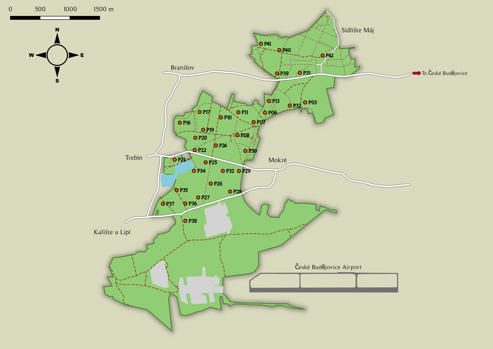

# Abstract {.unnumbered}

TBD

<!-- The general effects of canopy cover can be separated into those of heterogeneity---which might affect birds through light conditions---and those of absolute densities---which might indirectly affect other aspects of the habitat such as tree girth. -->


# Keywords {.unnumbered}

TBD

\newpage

```{r setup, include=FALSE, echo=FALSE, message=FALSE, warning=FALSE}
knitr::opts_chunk$set(echo = TRUE)
```

# Introduction


Animals assess a wide variety of environmental features at multiple scales, and make a series of hierarchical choices resulting in a preference for certain habitats over others, which is termed habitat selection [@johnson1980; @cody1985]. Broad-scale selection is reflected in species' geographic ranges and in the landscape features surrounding home ranges, while fine-scale selection is reflected in microhabitats used for foraging, reproduction, and shelter [@fretwell1969; @johnson1980; @saab1999]. This raises questions about the ways in which these preferences vary across species, space, time, etc. In birds, however, much of our knowledge on habitat selection is dominated by the breeding season---encompassing both the actual reproductive period as well as the period leading up to mating [e.g., @danchin1998; @bosco2021]. Moreover, most such studies target migratory species, whether it be in their breeding grounds [e.g., @danchin1998; @kleist2017], wintering grounds [usually in the tropics\; e.g., @strasser2019; @ruiz-sanchez2017] or stopover sites [e.g., @papageorgiou2017; @wolfe2014; @cohen2021]. This disproportionate attention is not unjustified: reproductive success and offspring survival have traditionally been strongly linked with fitness, and fitness outcomes are influenced via costs (e.g., predation risk) and benefits (e.g., food availability) of habitat use. In migrants, habitat requirements are complex and vary through the annual cycle, across their geographic range, along migratory routes, and at multiple spatial scales [e.g., @devries2018; @wolfe2014; @rodewald2004; @winker1995].

Nevertheless, there is slowly growing evidence that habitat selection in birds may differ seasonally due to the varying ecological requirements and pressures during the different seasons [@akresh2009; @vitz2011; @dittmar2014]. In the context of temperate birds, questions regarding habitat selection, niche breadth and community structure take on new dimensions in the post-breeding period. For one, the birds are less territorial and more mobile, allowing greater freedom in choosing foraging areas [@uesugi2007]. Additionally, motivations for habitat selection are straightforward and unambiguous; the main challenges are food scarcity coupled with increased food requirements, and the consequently higher predation risk---both for migrants that need to build up enough nutritional reserves and for residents that need to prepare for the oncoming winter. Parent-dependent fledgelings also transition to independent young birds that have to overcome challenges brought by the changing season and by their lack of experience in foraging, navigating and avoiding predators [@anders1997]. Especially to them but also to adults, dense vegetation may provide cover and protection from adverse weather and predators. Dispersing juveniles may even collect social information regarding future site quality during the post-breeding period [@betts2008a]. Finally, this period represents a transition from summer to winter, which might also result in a gradual shift from one selection strategy to another over the post-breeding period. Thus, not only might habitat preferences in the post-breeding period be different from this during the breeding season, but they might also be dynamic over the course of the season. This warrants an investigation of post-breeding habitat selection at a fine temporal resolution.

Among temperate forests, oak forests are widely believed to be the most biodiversity-rich, supporting a highly diverse arthropod community which in turn supports a larger vertebrate community [@kennedy1984]. Many migratory birds become facultatively frugivorous in autumn [@herrera1978a; @gauthreauxjr1982; @parrish2000; @salewski2006] and therefore less reliant on the declining arthropods. However, temperate forests in Europe can have lower fleshy-fruit plant diversity than North American ones [@campbell1982], which might limit dietary options for post-breeding Central European forest birds. These various ecological pressures may give rise to competitive interactions. With interspecific competition, species within the same guild would have smaller overall habitat breadths and overlaps, due to similar resource-use patterns [@svardson1949]. On the other hand, predation is more important than feeding competition---which is generally lower between species than within [@terborgh1990a]---in closed habitats such as woodlands because predators attack at a close range. The absence of competition would allow species in the same guild to overlap more and take advantage of a shared feeding strategy. Hence, birds can be expected to select for habitats that maximise foraging efficiency and, eventually, survival. For instance, mixed-species foraging flocks not only allow higher and more efficient foraging rates but also minimise costs of vigilance against predators [@sridhar2009].

Habitat selection patterns and strategies are therefore likely to be driven more strongly by characteristics of the habitat (e.g., vegetation structure) than by dietary preferences, and can be analysed by comparing bird abundances or densities with habitat features such as canopy cover, habitat heterogeneity, tree density, and species richness [@vitz2007]. For instance, @berg1997 found that breeding bird abundances correlated positively with the presence of deciduous trees and with tree diameter, while among conifers the Norway spruce *Picea abies* was preferred over the pine *Pinus sylvestris*. Spatial segregation of habitats at a relatively fine scale is suggested to allow for the co-occurrence of more species. However, most modern-day forests in Central Europe have been restructured towards commercially exploited plantations dominated by spruce that form compact growths with a closed above-tree layer at maturity [@fanta2007]. As a result, birds during the post-breeding period could show a strong foraging preference for oak forest patches, which not only support higher biodiversity but also have more heterogeneous canopies and understoreys than the structurally uniform coniferous forests [e.g., @bergner2015]. Therefore, even if habitat characteristics are more important during this period than dietary preferences, foraging guilds might opt for different selection strategies. Omnivores, which tend to be more generalist and might also join mixed-species flocks, might prefer habitat patches with higher heterogeneity, openness, and structural and biological diversity. On the other hand, the specialist invertivores, which do not prey on external-feeding herbivores, might prefer the more homogeneous and dense stands of coniferous forest.

In this study, we investigated patterns of habitat selection exhibited by forest bird communities in the post-breeding period at a fine-grained temporal (weeks) and spatial (patches) resolution in Central Europe. Our main objectives were to identify the structural or biological habitat features that are tracked most prominently in this period of high stress (the autumn-winter transition), to assess the patterns and magnitude of habitat selection as well as their possible temporal dynamism across the seasonal transition, and to determine whether selection strategies differed between bird foraging guilds.

# Methodology

## Study site

The study was conducted over the course of three months (13 weeks), from the first week of July 2020 to the first week of October 2020, in a typical structurally manipulated and commercially used patch of Central European temperate mixed forest (*Branišovský les*) close to České Budějovice, Czech Republic. The forest is located on the western edge of the city (48°58'55.672"N, 14°25'22.907"E), and represents a semi-urban forest stretch of around 800 ha segregated from neighbouring forests by extensive farmland, large fishponds and settlements. Situated at an altitude of approximately 400 m asl, it is technically a mixed forest, but is very patchy owing to the long history of forestry regimes as well as its connection with rural and military Czech history. The patches range from pure Norway spruce *Picea abies* plantations to mixed stands dominated by oaks (*Quercus* spp.). For more details on the species composition of the vegetation community, see *Supplementary Material section*.

The entire forest stretch---with the exception of some parts either too disturbed or having restricted access---was effectively covered by selecting 32 non-random, evenly distributed circular sampling points of 30 m radius (Figure 1). They were chosen such that each point was at least 250 m away from its neighbours, so as to ensure spatiotemporal independence of consecutive point counts. Thus, the absolute cumulative area covered by the sampling points was approximately 9 ha. Clear cuts were avoided as much as possible. The selected set of points represented well the natural range and diversity of habitat characteristics in the entire forest.

## Habitat surveys

Vegetation features potentially relevant to birds in the post-breeding period were selected and measured to initially characterise the various habitat patches. The habitat class of each sampling point was recorded according to whether asphalt roads ('Road') and forest-to-farmland transitions ('Edge') occurred within 150 m from the centre of the point or not ('Interior'). This was done using an aerial map (Mapy.cz). At each of the 32 points, all tree and shrub species within the 30 m radius were identified and counted, and the vertical strata to which they belonged noted ('Canopy' or 'Understorey'). Species identities were used to calculate species richness and diversity [Shannon's diversity index\; @shannon1948], while counts were used to calculate density per 100 m^2^. For other plants that classified as ground vegetation, only broad identifications were made (e.g., graminoids or mosses), and instead of counting them only the 'dominant' species (covering roughly $\ge$ 50% ground area) were identified. In addition, presence or absence of moss in the point was noted separately regardless of whether or not it was the dominant ground layer vegetation, as its presence usually indicates the quality of and disturbance within the forest patch [@berdugo2018; @cornelissen2007]. *Section 1 in Supplementary Material* details the habitat characterisation methodology.

We also calculated the proportion of deciduous trees in the 'Canopy' as this has been shown to be a more important factor than measures of tree diversity [@berg1997]. Canopy cover at a sampling point was measured using canopy photographs taken at three equidistant sub-points within 10--15 m of the centre, which were then analysed using ImageJ software [@rasband1997] by converting to binary black-and-white images and calculating the percentage of cover across the whole image [see @forester2011\; *Figure S1*]. The measurements from each sub-point were averaged to represent mean canopy cover of a point, while the standard deviation of the three values represented the heterogeneity in canopy cover in the point (high values signifying high heterogeneity). These canopy measurements were originally taken once in each sampling week, but most deciduous trees bore leaves even in the last week of sampling. Hence, the 13 weekly measurements of both canopy variables for each sampling point were instead averaged to provide more accurate measures of both, and these were used in the analyses. Lastly, phenological characteristics of leaves, flowers and fruits of the plants in each point were also recorded weekly on an ordinal scale in order to track fruiting, flowering and leaf senescence patterns across the study period *(Section 2 in Supplementary Material)*.

## Bird counts

We surveyed bird 'abundance' by means of fixed-radius point counts, using detections as a proxy for abundance. While detections are not an accurate measure of true abundance, with many vegetation characteristics and behavioural traits affecting detectability of birds, it was sufficient for our purposes due to two reasons. First, we were not interested in estimating true population size, but rather in assessing relative habitat use using the proxy of relative abundance. Second, our sampling points did not vary greatly in terms of vegetation characteristics that hinder detectability, or in detectability of different bird communities. In fact, most birds have similarly low levels of vocal activity in the post-breeding period.

Point counts were done at each of the 32 sampling points every week for 13 weeks (8 July 2020--1 October 2020), thus covering the post-breeding period from late summer till early autumn at a fine-grained temporal resolution. Sampling was done on 2--3 days in the middle of the calendar week while the remaining days served to delineate and separate two successive 'temporal units'. This enabled meaningful comparisons of bird abundances across weeks, as each would be sufficiently independent of the other and would thus represent a distinct time point *(Table 1)*.

We used this continuous measure of time (and seasonality) rather than categorical factors like 'post-breeding period' and 'pre-migratory period', for better comparability. Firstly, there is high ambiguity and arbitrariness in the literature regarding exact definitions of these seasons. Moreover, such categories would have very different meanings and implications depending on location. For instance, 'pre-migratory periods' in the northernmost parts of Scandinavia would be extremely different from those in, say, southern Czech Republic. Instead, measuring in numbers of weeks identified by a standard time unit (the Gregorian calendar) allows easy interpretation of results. Finally, such a measurement of time provides a much finer temporal resolution, which could be important in spotting patterns developing at a relatively short time scale.

We conducted 12--20 bird counts per sampling day, during the first five hours after sunrise (which shifted forward by around 10 minutes every week). Each point count was associated with several variables *(see Table 2 in Supplementary Material)* such as Point ID, sampling day and week, observer, and other non-focal variables such as weather, visibility and time of count (on an ordinal scale from 1 to 10 representing which part of the first five hours of sunrise the count was done in). Overcast and rainy days were avoided. We recorded the presence and counts of all birds heard or seen during a period of 20 minutes, divided into four intervals of five minutes each. Additionally, complementary information for each detection, like type of detection (visual, auditory or both), behaviour such as flyover (over the forest, within the forest canopy or not flying) or foraging (yes or no), and distance class were noted. Distance classes referred to five radial bins from the centre of the point: 0--10 m, 10--20 m, 20--30 m, 30--50 m and $\gt$ 50 m. Additionally, birds were observed for whether or not they entered the 30 m radius (i.e., entered the sampling point) at any time during the count, signifying the bird's 'use' of the habitat. 

All birds were identified to species level when possible, but some closely related cryptics such as *Phylloscopus* spp., *Certhia* spp., *Regulus* spp. and *Dendrocopos* spp. are easy to confuse and difficult to identify correctly with just the occasional post-breeding vocalisations, and hence were often recorded as 'spuhs'. Prior to analysis, bird species were also classified based on feeding guild, which was determined using @gregory2007 (pt. Appendix 1) and Birds of the World [@billerman2020]. 

## Data analysis

To assess patterns of habitat selection by birds, we first excluded birds not identified to genus level, those detected flying over the forest and those that did not enter the 30 m radius in point counts. The measured habitat variables, without those excluded due to correlations, represented the pool of candidate predictors *(Table 2 in Supplementary Material)*. This set of plausible predictors was then used to build generalised linear mixed models (GLMMs) following an information-theoretic approach [@burnham1998]. That is, the Akaike Information Criterion [AIC\; @akaike1973; @akaike1974], and more specifically the corrected AIC or AIC~C~ [@hurvich1989], was used to judge model fit.

Analyses were conducted at two main levels of response. At the highest level, we looked for patterns of habitat selection in the whole bird community, by summing all the individual species detections per point count to obtain one 'bird abundance' value for each count, which was then used as the response variable. GLMMs were constructed using the *lme4* package [@bates2015], with the null model containing observer as a fixed effect (detections had *71:29* observer ratio) and sampling points and days as crossed random effects (model construction detailed later). Point ID was used a random effect because of repeated sampling in the same points over the 13 weeks, and sampling day in order to account for the random variability in each unique day. Residuals were modelled as coming from a Poisson distribution with a log link function.

At the second level, we investigated whether foraging guilds differed in their habitat selection patterns. The original bird observations were summarised by guild so as to obtain for each point abundance values of all the guilds that were observed. Only two guilds had sufficiently high number of overall detections, insectivores (rather, 'invertivores') and omnivores. Models were built separately for these two guilds, using the *glmmTMB* package [@brooks2017] to avoid convergence issues. The data summarised at guild level was insufficient for utilisation of two crossed random effects (as was done for the community-level models), so the random effect of sampling day, which had less estimated variance than that of the point, was excluded from the models. This did not result in major differences in the fixed effects estimates and so was not considered to be an issue. The null models had the same fixed effect as in the first case.

Models were constructed following a null model approach, i.e., starting from a null model then building up using stepwise selection of predictors. First, the week variable which had a visible effect (abundances were higher towards the end of the study period; noticed even during the bird counts), and other non-focal variables were added. Following this, the other, focal variables were finally added *(see Table 1)*. Stepwise selection was done by comparing AIC~C~ values of all the models using the AICctab() function from the *bbmle* package [@bolker2020], with an information threshold of 2 dAIC~C~ per df. If a variable was deemed important, its interaction with 'Week' was next tested (i.e., whether or not habitat selection criteria changed with the progress of the season). Once the selection was complete, parsimony was further tested by dropping some complex interaction terms. Finally, the most parsimonious model was selected. At the community level, the final model was a GLMM with Poisson error distribution and log link function fitted with the BOBYQA optimiser *(Table 2)*; the guild-level final models were a Poisson GLMM (log link) for invertivores and a negative binomial GLMM (log link) for omnivores.

For continuous or ordinal variables, both linear and polynomial terms were tested since there was no reason to assume a linear relationship with the predictors. Model diagnostics of all models were explored using the *DHARMa* package [@hartig2020] for distributional assumptions, heteroscedasticity, over-/underdispersion and zero-inflation. All analyses were done using R version ***4.1.1*** [@rcoreteam2020]. Individual figures with multiple graphs were composed using the *patchwork* package for R [@pedersen2020a].

# Results

A total of 7,367 detections of 69 bird species were made, of which 62% (4,527) did not meet the criteria for inclusion in the analysis. Of the 2,840 detections of 45 species anlaysed, 78% (2,209) were purely auditory, 7% (201) were purely visual and 15% (430) were both, and this did not change majorly with weeks or across points (Figure S3). The average number of detections per point count varied from 5 in Week 1 to 9 in Week 13 (Figure 2). Among 494 records of birds foraging, just two were of frugivory.

At the community level, bird abundance was affected by observer, week, canopy heterogeneity, tree density, and dominant ground vegetation and its interaction with week. In spite of the significant correlations between canopy heterogeneity and canopy cover (r = -0.533, p = 0.0017), and between canopy cover and tree density (r = 0.526, p = 0.002), canopy heterogeneity and tree density remained uncorrelated (r = -0.246, p = 0.1745). Further, tree density also correlated negatively with proportion of deciduous trees at a significant level (r = -0.545, p = 0.0013), but seemed to be the more important predictor in the models.

There was an overall increase in bird abundance towards the end of the study period in all sampling points---across the five categories of ground vegetation---but the magnitude of increase was starkly different in each. Points with *Rubus* sp. and those with *Vaccinium* sp. as the dominant ground vegetation had intermediate values of both average abundance and increase in abundance with time. Points with graminoids in the ground layer had the lowest overall abundance as well as the lowest increase (Figure 3). Points with ground layers comprising moss and bare ground both had low abundances in the beginning but towards the end had the highest abundances, i.e., they showed the strongest increases. Bird abundance related positively and negatively with log-transformed variables of canopy heterogeneity and tree density respectively (Figure 3) and these trends did not change noticeably over the course of the study period.

Within the bird community, habitat selection was very different between invertivores and omnivores (Table 3). Invertivore abundance was affected by observer, proportion of deciduous trees and dominant ground vegetation. Abundance was lower in sampling points with 'Graminoid' ground vegetation than points with other ground layers (Figure 4). Abundance also decreased with deciduous proportion and, notably, since a polynomial term did not give a better fit, there is no evidence for the notion of mixed forests with intermediate deciduous proportions having higher diversity and abundance. Neither of the two trends changed detectably with time.

On the other hand, omnivore abundance was affected by observer, habitat class, tree density, and canopy heterogeneity, and it changed with time. Abundance of omnivores generally increased as the season progressed, and decreased with increasing tree density, but overall was higher in forest edges than in forest interiors or roadside patches (Figure 5). With canopy heterogeneity, the initial trend appeared to be slightly negative yet almost insignificant, but with every week the trend became more and more positive, such that in week 13 it was very strong. In other words, omnivores were initially indifferent to canopy heterogeneity, and as the season progressed their abundance did not change in relatively homogenous points, but greatly increased in highly heterogenous points (Figure 5).

# Discussion

The overall abundance of the forest bird community after the breeding season seemed to be higher in patches where the canopy was highly heterogeneous. As invertivores did not show any particular relationship with canopy heterogeneity, the trend is probably driven by omnivores. At the beginning of the survey, omnivore abundance too was not related to canopy heterogeneity, but this was completely reversed by the end of the study, with the most heterogeneous points having the highest abundance---twice that of the least heterogeneous points which did not see any change in bird abundance at all over the course of the season. The arrival of migrants may have caused an occupation of the previously 'empty' niche and this was most likely because heterogeneity enables the formation of large foraging flocks, with different individuals in the party focused on different aspects of the habitat.

## Post-breeding birds track structural characteristics over species diversity

## Canopy heterogeneity as part of habitat heterogeneity

Heterogeneity has been explored before in habitat selection studies, but the focus has mostly been on heterogeneity in habitat and not in the canopy. For example, @freemark1986 observed positive trends of bird richness and abundance with overall habitat heterogeneity (combination of species compositions and forest structure) and forest size, which are expected to correlate. Canopy heterogeneity however, along with canopy cover, affect light availability within the forest, which would result in higher foraging efficiency and thus can be crucial in foraging for invertebrates in autumn when the conspicuous prey are depleted. Heterogeneity could also explain higher omnivore abundance in forest edges. In our study across multiple points of the same area within the same forest tract, the relation between omnivore abundance and canopy heterogeneity evolved with time, suggesting that these preferences are driven directly or indirectly by seasonally changing conditions such as increasing foraging pressure. Canopy cover was not included as a predictor and hence its effect cannot be compared, but heterogeneity might potentially be more important to birds than average cover, as heterogeneous patches provide better light conditions whilst retaining some other desirable properties of the habitat. Patches with low cover, despite having good light conditions, might not have sufficiently good vegetation characteristics. This could be indicating two separable properties of the canopy that go unnoticed in habitat selection studies.

Despite the absence of a significant correlation between canopy heterogeneity and tree density, the latter was negatively related to bird abundance (at the whole community level as well as in omnivores but not insectivores). Since a vast majority of bird detections were auditory and since auditory detections are not limited by such temperate forests with poor understorey layers, the possibility of poorer detection rates with higher tree density can be ruled out, though it is unknown whether tree density also affects overall bird behaviour. In omnivores, the structural preference rather than biological preference (like deciduous/coniferous) suggests that being generalists, they are not particular about the nature of their food source. At the same time, the correlation between canopy cover and tree density, despite being statistically significant, is weak at low densities, suggesting that the preference of birds for low density patches might be driven by some factor other than light availability. For instance, @menon2021 found that tree density across various sites in a low-latitude temperate forest, comprising both protected and managed patches, was highly negatively associated with mean tree girth, and observations suggested a negative relationship with canopy height as well. While these could be due to suppressed regeneration and sapling growth, and therefore indirectly due to light availability (shade effects), both variables were positively linked with bird abundance and richness [@menon2021]. Wider and taller trees are expected to host a larger and more diverse group of arthropod prey species as a result of greater diversity of microhabitats. @wolfe2014 suggested that because forest-dwelling arthropod species are often cryptic [@bond2007], it may be inherently difficult and inefficient for an insectivore to directly assess the availability of arthropods, particularly in resource-scarce periods. They suggested this to be the reason why insectivores, unlike frugivores, tracked structural cues, including but not limited to tree density, canopy closure and percentage ground cover. However, our 'invertebrate-feeding' species are naturally specialised on cryptic prey species. This could be why they tracked the qualitative features of the food resources (indirectly by the deciduous/coniferous distinction) over structural characteristics. On the other hand, the generalist omnivores (which still relied to an extent on arthropods due to the low diversity of fruiting plants) would have had difficulty foraging for these cryptic species, and hence attained higher foraging efficiency by tracking structural characteristics, especially with the formation of foraging flocks.

## The surprising role of oak in post-breeding season

Birds generally show a hump-shaped trend with proportion of deciduous trees, with highest numbers found in mixed forests and lowest in both purely coniferous and purely broadleaved patches [e.g., @alatalo1981; @jansson2003; @hagar2007; @ohno1997; @felton2010]. However, in alignment with Alatalo's findings [-@alatalo1981] that relative use of such deciduous patches were strong in summer but declined in winter, omnivores in our study in the summer-winter transition showed neither a linear nor a polynomial relationship with proportion of deciduous trees, while invertivore abundance declined with deciduous proportion. Oaks are usually linked with higher biodiversity (especially *Q. robur*, which is highly insect-rich and has the highest visitation rates by birds), but oak-rich points in our study were poorest for birds in both periods. It is to be noted that a majority of the herbivorous arthropods on oaks belong to Lepidoptera [45% of the total species richness of phytophages on *Q. robur/petraea*\; @kennedy1984], which attain a peak density in spring. The trees see relatively very low lepidopteran attacks after mid-June [@feeny1970]. When considering all phytophagous insects, there is a second but much smaller peak in abundance in late summer and early autumn of suckers, leaf-miners and gall-formers [@southwood2004]. Thus, the overwhelming preference for oaks by arthropods, and consequently by predatory birds, is likely to be prevalent mainly in spring and summer. The arthropod communities of oaks and their regulation by predators has rarely been explored in the post-breeding periods of late summer and early autumn. Moreover, the specific invertivore species present during this summer-autumn transition period such as treecreepers, robin and goldcrest/firecrest are largely specialists and do not prey on external-feeding herbivores. Treecreepers are bark-feeders, robin is mostly a ground-forager and goldcrest is specialised for spruce [firecrest shows no preference for either conifers or broadleaf trees\; @leisler1982].

While many studies [e.g., @alatalo1981] directly compare the impacts of tree density and deciduous proportion as habitat variables, the two could have different implications to birds and hence could be selected for differently. At the community level, tree density provides a better fit than proportion of deciduous trees despite their significant correlation, likely due to the variability in values; the same value of tree density can arise in both conifer-dominated and deciduous broadleaf-dominated patches *(see Figure S6)*. Moreover, the overall trend with tree density in the model is negative possibly because the degree of initial avoidance of high-density spruce patches was relatively high while the subsequent preference was not high enough to appear statistically as an interaction of the variable. It became visible, however, when the sampling points were split into groups based on ground vegetation. Interestingly, the same effect was absent with pine, the other common conifer, which could mean that pine is less important than spruce in our study area. @berg1997 similarly observed positive correlations of bird abundance with spruce and none with pine, but this was during the breeding season when spruce is believed to be preferred over pine due to its special canopy structure that provides protected nest sites, and possibly also due to differences in productivity and food availability. On the other hand, @alatalo1981 noticed that foliage-gleaners preferred pine over spruce, presumably due to the abundance of eggs of Lachnidae on pine needles, but this was in winter. However, he also suggests that species like firecrest and *Turdus* thrushes forage in pine forests in late summer, despite avoiding it during the nesting season.

## Understorey

The common understorey species in our forest were *F. alnus* and *P. abies*, followed by *Q. robur/petraea* and *B. pendula*. Other species occurred rarely and even when they did, were sparse, isolated and in very few numbers. The presence of shrubs in the understorey is generally expected to be good for small passerines [@bergner2015], but there was no detectable trend in bird abundance with understorey characteristics such as richness, diversity and density. One potential reason for this could be that the understorey characteristics we measured did not vary across a large enough range in our study site so as to be of significance to the birds. Hence, different results could be expected in other larger, less-degraded and naturally more diverse forests.

Surprisingly, the dominant ground layer vegetation had a great effect on bird abundances at the community level. Canopy heterogeneity, understorey density and understorey diversity were not particularly different between these different groups of points, and there were only weak patterns with canopy cover, richness and diversity. However, as observed in a central Swedish forest by @berg1997, the ground vegetation seems to be related to tree species composition. Specifically, there is a complex interplay of conifer presence and tree density, as follows.

The 'Moss' points (two in total), relative to all other points, had the highest tree densities, very low deciduous proportions (lowest oak numbers) and very high spruce numbers *(Figure S7; see also Figure S2 A)*. Some of the 'Bare' points (no dominant ground layer vegetation) also had high tree densities and high numbers of spruce, although others had varied characteristics. Bird abundance in both 'Moss' and 'Bare' points was very low in the beginning and very high in the end of the survey. Several points other than 'Moss' and 'Bare', including one 'Graminoid' point, had relatively low proportions of deciduous trees but these consisted mostly of pine and not spruce. While the relation of different ground layers with pine was similar to that with spruce, it was not as strong.

'Rubus' and 'Vaccinium' points generally had mixed canopies with high deciduous proportions and low spruce numbers as well as low tree densities ('Rubus' had the lowest). Such points had intermediate values of both average bird abundance and increase in abundance. Finally, while other points had intermediate oak numbers, 'Graminoid' points had the highest [like the 'grass' vegetation in @berg1997] and these were also associated with generally low canopy heterogeneity. These points had the lowest average bird abundance as well as its increase. Thus, the fact that the dominant ground vegetation which is indirectly linked to qualitative nature of tree species was not important for omnivores, especially with the arrival of the migrants, further solidifies that omnivores tracked only structural features, and that they were otherwise rather evenly distributed over the study area.

## Changing with the seasons

Thus, birds early in the season preferred mixed forest patches that had some canopy heterogeneity and low tree densities (which could in turn be related to either tree girth or deciduous proportions), and avoided spruce-dominated points. However, closer to autumn, these points with highly dense canopy structure were increasingly utilised and preferred, and had the highest bird abundances in the end. All this might be suggesting that although mixed species composition, canopy heterogeneity and low tree density are generally the best features and hence can be considered as generally good for birds (such points had relatively high abundances in the end too), spruce-dominated dense patches represent an initially low-value niche that turns into a high-value niche.

The general abundance increase in the bird community as the season progressed was likely not due to better detection rates as the birds became bolder and more active, but rather due to migrants arriving from the north to winter here, although trapping and tracking of individual birds is necessary to confirm this. Further, while abundance of omnivores increased with time, that of invertivores remained largely constant. This agrees with the fact that most of the northern migrants that arrive here are omnivores (tits), also suggesting that detectability of the naturally quiet invertivores was not a major issue in this study. Unexpectedly, there were very few instances of birds feeding on fruits. This could be either because arthropod abundance in the forest was still high enough to support the birds, or because the birds in this region---mostly non-migrants or partial omnivorous migrants---simply do not shift their foraging strategy, unlike birds elsewhere [see @parrish1997; @parrish2000], and rather only feed on fruits facultatively.

## Guilds

The two guilds showing different relationships with habitat characteristics is indirect evidence of differences in their resource-use strategies. Invertivores were selective only about one major characteristic, but were highly specific and consistent about it: they avoided oak-dominated homogeneous patches of forest, preferring spruce patches with heterogeneity, and were otherwise broad in resource-use. Omnivores, on the other hand, were affected by a larger interplay of factors and their patterns changed over time, probably because they had to adjust and accommodate the new arrivals. They did not seem to be specific about food resources directly. Rather, they showed a slight structural preference for forest edges with low densities of trees and this remained constant with time, but they formed an additional strong preference for highly heterogeneous areas as the season progressed. The latter could have been extremely important in accommodating the northern arrivals and presumably also enabled the large mixed-species foraging flocks. @alatalo1981 found evidence for the prevalence of interspecific competition in the seasonal environment of Finland. In our case, such competition brought about by migrant arrival was presumably mitigated by the omnivores choosing to form mixed-species flocks. The model for omnivores had a negative binomial distribution, implying overdispersion in omnivore abundance values, corroborating the presence of such flocks.

## Conclusion

The measure of canopy heterogeneity used in this study is insightful, but its accuracy can be improved by perhaps using five or more sub-points. Canopy height, stratification, tree girth, and age of forest are variables that could have important effects as well and hence can be incorporated. Although the observer effect in the bird count data was statistically accounted for in all the models by inclusion as a fixed effect, future study designs should try to involve either a single observer or a large number of observers. Extending the scope of such studies that use a continuous measure of seasonality by starting from the pre-breeding period will be extremely useful, not only as a reference but also potentially helping to show larger patterns. Finally, although the continuous measure allows better comparability of our results, other factors affecting comparability such as choice of bird survey method and habitat variables persist in our study.

In conclusion, birds did indeed exhibit habitat selection in the autumn-winter transition, with different guilds tracking structural (such as canopy heterogeneity, tree density and ground vegetation) and biological (such as deciduous proportion) characteristics differently based on resource-use strategies. Additionally, preferences of insectivores were rather simple, specific and consistent, while those of omnivores were complex and varied with season. Our study thus sheds some light on the overlooked question of habitat selection in post-breeding temperate forest birds, and also highlights the need and potential avenues for further research expanding our knowledge on this topic.


# References

::: {#refs}
:::

\newpage

# Tables and figures



***Table 1: The continuous measure of time (Week) used to test for patterns in habitat selection, with corresponding weeks (starting on Monday) in the Gregorian calendar.***

***Figure 2: The trends in bird detections per point count with season and habitat. (A) Large circular dots represent mean bird detections per point count for each week averaged over all sampling points. Whiskers represent 95% confidence intervals (CIs). (B) Thick horizontal bars within boxes represent median value of bird detections per point count for each point over all sampling weeks. Top and bottom box hinges are the 1st and 3rd quartiles respectively (25th and 75th percentiles). Respective whisker ends are distances to data points ≤ 1.5 × IQR (interquartile range) from respective hinges. Small circular dots are data points ≥ 1.5 × IQR from hinges (outliers).***

***Table 2: GLMMs using abundance of all birds as the response. Models at each step of term addition/deletion are shown (as 'all.x') with their corresponding information such as degrees of freedom (df), predictor terms, log-likelihood, AICC (which was used as a selection criterion) and Akaike weight. 'CH': canopy heterogeneity; 'TD': tree density; 'DOM': dominant ground vegetation. Selected model, 'all.6': bird abundance \~ observer + (1\|point) + (1\|day) + week + log(canopy heterogeneity) + log(tree density) + ground vegetation + week:(ground vegetation)***

***Figure 3: Abundance of all species of birds varying with habitat characteristics of each sampling point, as predicted by the best-fitting model 'all.6'. (A) Coloured lines show mean abundances changing with weeks on X-axis. Coloured ribbons around the lines represent 95% CIs. (B) Large circular dots represent mean bird abundance per point count. Whiskers represent 95% CIs. Dark orange colour represents Week 1 and dark blue represents Week 13. (C, D) Coloured lines show mean abundances and corresponding ribbons represent 95% CIs. Dark orange colour represents Week 1 and dark blue represents Week 13.***

***Table 3: GLMMs of guild abundances with habitat variables. Model names 'inv.x' refer to invertivore models while names 'omn.x' refer to omnivore models. Models at each step of term addition/deletion are shown with their corresponding information such as degrees of freedom (df), predictor terms, log-likelihood, AICC (which was used as a selection criterion) and Akaike weight. 'sTPD': scaled proportion of deciduous trees; 'DOM': dominant ground vegetation; 'HC': habitat class; 'CH': canopy heterogeneity; 'TD': tree density.***

***Figure 4: Abundance of invertebrate-feeding birds varying with habitat characteristics of each sampling point, as predicted by the best-fitting model 'inv.4'. (A) Large circular dots represent mean abundance per point count. Whiskers represent 95% CIs. (B) Line shows mean abundances and corresponding ribbon represents 95% CIs. X-axis shows proportions scaled from original range of 0--100%.***

***Figure 5: Abundance of omnivorous birds varying with habitat characteristics of each sampling point, as predicted by the best-fitting model 'omn.3'. Dark orange colour represents Week 1, pink colour represents Week 7 and dark blue represents Week 13. (A) Large circular dots represent mean abundance per point count. Whiskers represent 95% confidence intervals. (B, C) Coloured lines show mean abundances and corresponding ribbons represent 95% CIs.***